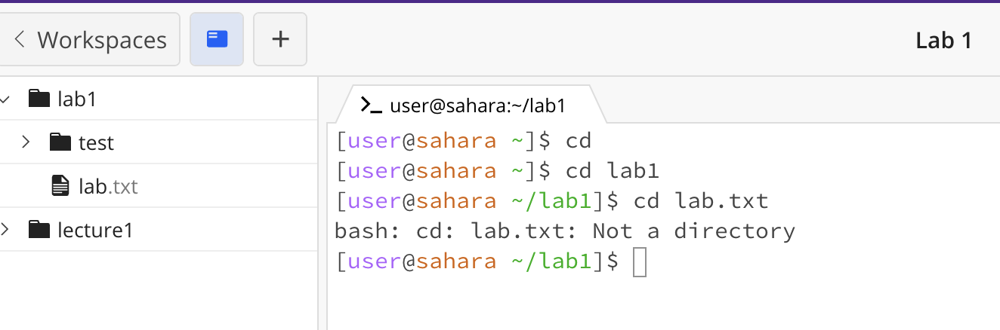
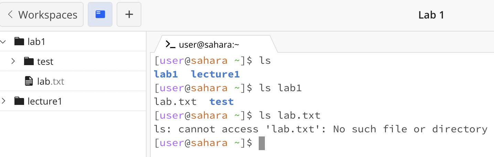
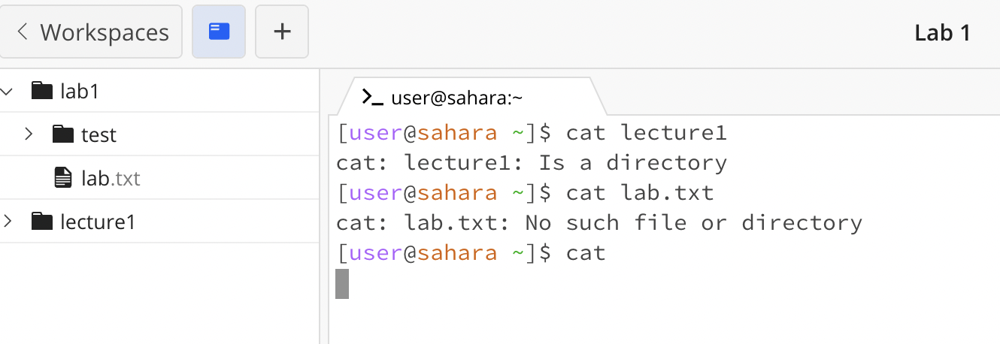

cd

- when running cd with no arguments nothing happened. there is no error but there is also no 'success' since cd is used to change directories and there was no directory written followed by cd. this was when the directory was /home
- when running cd with a directory, in this case 'lab1', the directory was changed to lab1. there was no error, it successfully changed directories to lab1. the working directory was /home and changed to /home/lab1 with this command.
- when running cd within the new directory with a file 'lab.txt', the error 'bash: cd: lab.txt: Not a directory' was outputed. I would assume this is because cd is used to change directories and giving it a file name would cause an error since it is looking for a directory, not a file. the working directory while running this command was /home/lab1.

ls

- when running ls with no arguments the folders within the current directory were outputed, in this case 'lab1' and 'lecture1'. this was not an error. ls is used to show the names of the files and folders inside the current working directory.
- when running ls with the directory 'lab1' the contexts of that folder were outputed: 'lab.txt' and 'test'. this was not an error. 
- when running ls with the file 'lab.txt' there is an error that says that ls cant access that file since theres no such file. this is because ls is used to check the contents of a directory, not a file. printing contents of a file should be used with a cat command.
- the working directory for all of these ls commands was /home

cat

- when running cat by itself nothing happens. this is not an error nor a 'success'. the cat command is used to print contents of a file so when there are no arguments inputed, nothing will print.
- when running cat with a directory 'lecture1' it outputs the error 'cat: lecture1: Is a directory'. cat is supposed to print the contents of the file so when it recieves a directory there isnt anything to print. 
- when running cat with a file 'lab.txt' it says that there is 'No such file or directory'. this error is because there was no filepath
- the working directory for all of these cat commands was /home
