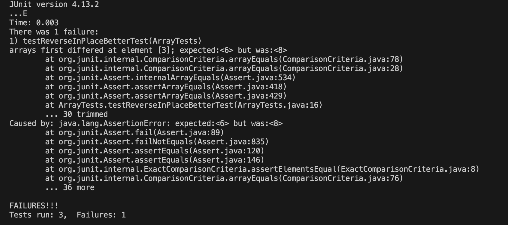

# LAB REPORT 3: CSE15L
---
## P1

**A failure-inducing input for the buggy program, as a JUnit test and any associated code (write it as a code block in Markdown)**

```
	@Test 
	public void testReverseInPlaceBetterTest() {
    int[] inputT2 = { 2,4,6,8,10,12 };
    ArrayExamples.reverseInPlace(inputT2);
    assertArrayEquals(new int[]{12,10,8,6,4,2}, inputT2);
	}

```


**An input that doesn’t induce a failure, as a JUnit test and any associated code (write it as a code block in Markdown)**

```
	@Test 
	public void testReverseInPlaceAlwaysRightButWrong() {
    int[] input1 = { 3 };
    ArrayExamples.reverseInPlace(input1);
    assertArrayEquals(new int[]{ 3 }, input1);
	}
```

**The symptom, as the output of running the tests (provide it as a screenshot of running JUnit with at least the two inputs above)**


**The bug, as the before-and-after code change required to fix it (as two code blocks in Markdown)
Briefly describe why the fix addresses the issue.**

```
  //old version of reverseInPlace
  static void reverseInPlace(int[] arr) {
    for(int i = 0; i < arr.length; i += 1) {
      arr[i] = arr[arr.length - i - 1];
    }
  }
```

```
  //new version of reverseInPlace
  static void reverseInPlace(int[] arr) {
    int[] test = new int[arr.length];

    for(int i = 0; i < arr.length; i += 1) {
      test[i] = arr[arr.length - i-1];
    }
    for(int i = 0; i < arr.length; i += 1) {
      arr[i] = test[i];
    }
  }
```
The problem with the code occurred because when we tried to move a value from the right end of the array to the left, it ended up overwriting the values in the same array we were taking from. This caused unexpected behavior. To fix this issue, I created a temporary test array and reversed the values in another array. This way, the values didn't interfere with each other. Then, I used another for loop to move the correct values from the temporary array back into the original one. The error is evident in the output, where they expected a 6 but got an 8 because, in the next iteration after the halfway point, the values on the right end were not correctly swapped.

## P2
`less`: according to google, it "shows a file's contents one screen at a time". When I used less, I got to see the terminal get replaced by the file text. This also takes over the terminal until you click q. 

4 alternate ways to use the command `less`:

***1) -o (filename)***

technical/ directory code :
```
less technical/biomed/ | less -o tested.txt
Output:
Warning: "tested.txt" exists; Overwrite, Append, Don't log, or Quit? 
Overwrite, Append, Don't log, or Quit? (Type "O", "A", "D" or "Q") 
```
The code isn't helpful because it just tells you that `/biomed` is a folder and doesn't do anything with it. Even if you save the output to a text file using `> tested.txt`, it will still show "is a directory." I discovered this behavior in the `less` command's manual in the terminal.


technical/ .txt code :
```
less technical/biomed/1471-2180-2-35.txt | less -o tested.txt
Output:
Background
        Mounting concerns about drug-resistant pathogenic
        bacteria [ 1 2 3 ] have rekindled interest in alternative
        treatments of bacterial infections. Prominent among these
        alternatives is phage therapy, the use of bacteriophages to
        kill or otherwise control the bacterial populations in
        infected hosts. The use of bacteriophage for the treatment
        of bacterial infections is an old idea [ 4 ] that not only
        caught the imagination of at least one novelist [ 5 ] it
        was practiced with sporadic successes worldwide in the
        1920s and 1930s. However, following the development of
        antibiotics in the 1940s, the use of phages to treat and
        prevent infections disappeared from so-called Western
        Medicine, but it did survive in the former Soviet Union....

```
This code copies the content of a text file into another file I made named "tested.txt." I learned about it while reading the `less` command's manual in the terminal.

***2) -e***

technical/ directory code :
```
less -e technical/biomed/
Output:                         
technical/biomed/ is a directory
```
The code is not practical because it simply reports that /biomed is a directory without taking any action. Even if you redirect the output to a text file using `> tested.txt`, it will continue to display "is a directory." I came across this information on the [less command manual page](https://man7.org/linux/man-pages/man1/less.1.html) while searching for less command-line options on Google.

technical/ .txt code :
```
less -e technical/biomed/1471-2180-2-35.txt
output:
Background
        Mounting concerns about drug-resistant pathogenic
        bacteria [ 1 2 3 ] have rekindled interest in alternative
        treatments of bacterial infections. Prominent among these
        alternatives is phage therapy, the use of bacteriophages to
        kill or otherwise control the bacterial populations in
        infected hosts. The use of bacteriophage for the treatment
        of bacterial infections is an old idea [ 4 ] that not only
        caught the imagination of at least one novelist [ 5 ] it
        was practiced with sporadic successes worldwide in the
        1920s and 1930s.
```
The `-e` option in the code allows you to exit the terminal page when you reach the bottom of a file, indicating that you're finished and don't need to stay on that page. I discovered this feature in the [less command manual page](https://man7.org/linux/man-pages/man1/less.1.html) while searching for less command-line options on Google.

***3) -N***

technical/ directory code :

```
less -N technical/biomed/
Output:             
technical/biomed/ is a directory
```
This code doesn't do anything useful; it just tells you that /biomed is a directory. Even if you save the output to a text file using `> tested.txt`, it will still say "is a directory." I learned this from the [less command manual](https://man7.org/linux/man-pages/man1/less.1.html) while searching for less command options on Google.

technical/ .txt code :
```
less -N technical/biomed/1471-2180-2-35.txt
output:
  1 
      2   
      3     
      4       
      5         Background
      6         Mounting concerns about drug-resistant pathogenic
      7         bacteria [ 1 2 3 ] have rekindled interest in alternative
      8         treatments of bacterial infections. Prominent among these
      9         alternatives is phage therapy, the use of bacteriophages to
     10         kill or otherwise control the bacterial populations in
     11         infected hosts. 
```
The `-N` option in the code treats each line as an iteration, effectively counting the total number of lines in the file. It's a handy way to keep track of the line numbers in your file. I discovered this feature in the [less command manual page](https://man7.org/linux/man-pages/man1/less.1.html) while looking up less command-line options on Google.

***4) -p (pattern)***

technical/ directory code :
```
less -p use technical/biomed/
Output:
technical/biomed is a directory
```
The code isn't helpful because it just says that /biomed is a directory without doing anything. Even if you try to save the output to a text file using `> tested.txt`, it will still say "is a directory." I found the `-p` option in the [less command manual](https://man7.org/linux/man-pages/man1/less.1.html).

technical/ .txt code :
```
less -p use technical/biomed/1471-2180-2-35.txt
Output:
 Background
        Mounting concerns about drug-resistant pathogenic
        bacteria [ 1 2 3 ] have rekindled interest in alternative
        treatments of bacterial infections. Prominent among these
        alternatives is phage therapy, the use of bacteriophages to
        kill or otherwise control the bacterial populations in
        infected hosts. The use of bacteriophage for the treatment
        of bacterial infections is an old idea [ 4 ] that not only
        caught the imagination of at least one novelist [ 5 ] it
        was practiced with sporadic successes worldwide in the
        1920s and 1930s. However, following the development of
        antibiotics in the 1940s, the use of phages to treat and
        prevent infections disappeared from so-called Western
        Medicine, but it did survive in the former Soviet Union. A
        rekindled interest in phage therapy over the past decade
        has inspired historical reviews, increased our awareness of
        a substantial body of phage therapy work from Eastern
        Europe [ 6 7 8 ] , resulted in the West's "discovery" of
        the Eliava Institute (a one-time vast and thriving phage
        therapy research and production facility in Tiblisi,
        Georgia [ 9 ] ), and motivated the formation of companies
        developing phage therapy (Biophage Inc. of Montreal,
        Canada; Exponential Biotherapies Inc. of Port Washington,
        NY; Intralytix of Baltimore, MD). In recent years this
        renewed interest in phage therapy has been displayed in
        articles in the popular press, (e.g., Kuchment 2001,
        Superbug Killers, News Week, Dec. 17, 2001 50-51) and, of
        course, reviews and discussions on the internet,
        http://www.phage.org;
        http://www.evergreen.edu/user/T4/PhageTherapy/Phagethea.html.
```
The `-p` option allows you to locate a specific pattern, in this case, the word "use," within a .txt file. When you use it in the terminal, it highlights all instances of the word "use" in the text, making it useful for research and keyword searching. I discovered the `-p` option in the [less command manual](https://man7.org/linux/man-pages/man1/less.1.html).
