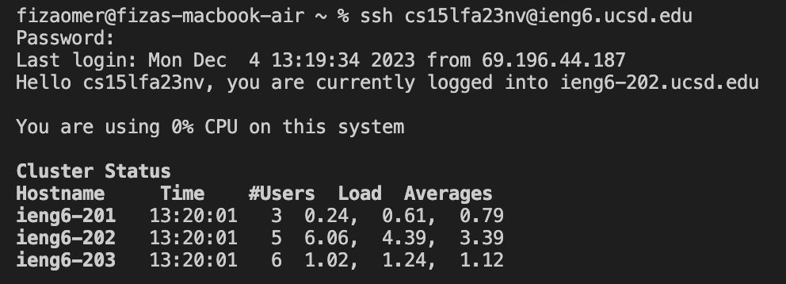

# Lab Report 4 - Vim

**4. Log into `ieng6`**

Keys pressed: `ssh <space> <command>c <command>d <enter>` 

I type `ssh` and copy and paste my account number "cs15lfa23nv@ieng6.ucsd.edu" from my note, and then press `<enter>`. I can successfully log into `ieng6` since I have already set key for login the Server `ieng6`.

**5. Clone your fork of the repository from your Github account (using the SSH URL)**

Keys pressed: `git <space> clone <space> <command>c <command>d <enter>`

I type `git clone` and then copy and paste the link `https://github.com/fiza-omer/lab-7` from my github website in lab7 repository. I can successfully clone this repository from my Github since I have created key in Server `ieng6` and link to the Github account for Authentication Keys. 

**6. Run the tests, demonstrating that they fail**

Keys pressed: `cd <space> l <tab> <enter>`, `bash <space> t <tab> <enter>`

I type `cd lab7` and press `<enter>` in terminal to change the directory to "lab7" since tab can autofill the folder name for "lab7" in current directory so I don't have to type the whole name. Then use `bash test.sh` to run the test since the bash script can run entire java file and type `t` and `<tab>` can autofill the file name "test.sh".

**7. Edit the code file to fix the failing test**

Keys pressed: `vim <space> L <tab> .java <enter>`, `?1 <enter> n x i 2 <esc> :wq <enter>`

I type `vim ListExamples.java` to enter the vim mode. Since there are java files and class files called "ListExamples" and "ListExamplesTest", the `<tab>` will only autofill with "ListExamples", I should type ".java" to complete the whole name. Then I enter to the vim mode to edit file. Second step is to change the "index1" to "index2". In command mode of "ListExamples.java", I type `?1 <enter>` to find the number "1" from bottom to top. The error is the second "1" so I press `n` to move to it. Then type `x` to delete this number since the curser is on "1". After that, I type `i2 <esc>` to change the mode to intert mode and add string "2" to the file and exit intert mode. Then press `:wq` to save and quit the vim.

**8. Run the tests, demonstrating that they now succeed**

Keys pressed: `bash <space> t <tab> <enter>`

I repeat the previous step and type `bash test.sh` to run the test since the bash script can run entire java file and type `t` and `<tab>` can autofill the file name "test.sh". Now, it should be succeed. 

**9. Commit and push the resulting change to your Github account (you can pick any commit message!)**

Keys pressed: `git <space> add <space> L <tab>, git <space> commit <enter>, i fixed <esc> :wq, git <space> push`

I type `git add L <tab>` to add file to the staging area since `<tab>` can autofill the file name "ListExamples.java". Then, I type `git commit` to make a commit to the file. The commit is same as vim mode so I press `i` to switch to the insert mode and type string "fixed" and `<esc>` is used to exit the insert mode. Then `:wq` is to save the commit and exit vim. Finally, type `git push` to push the changed file to the Github repository.

