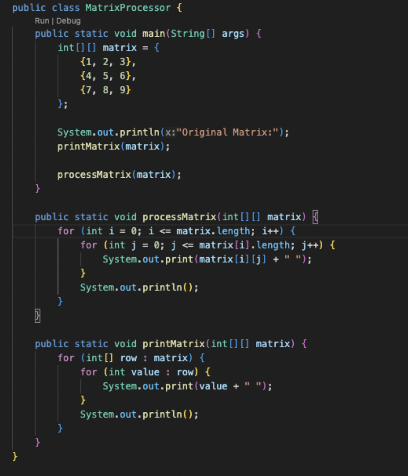
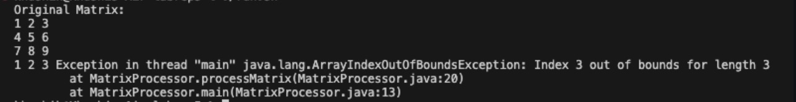
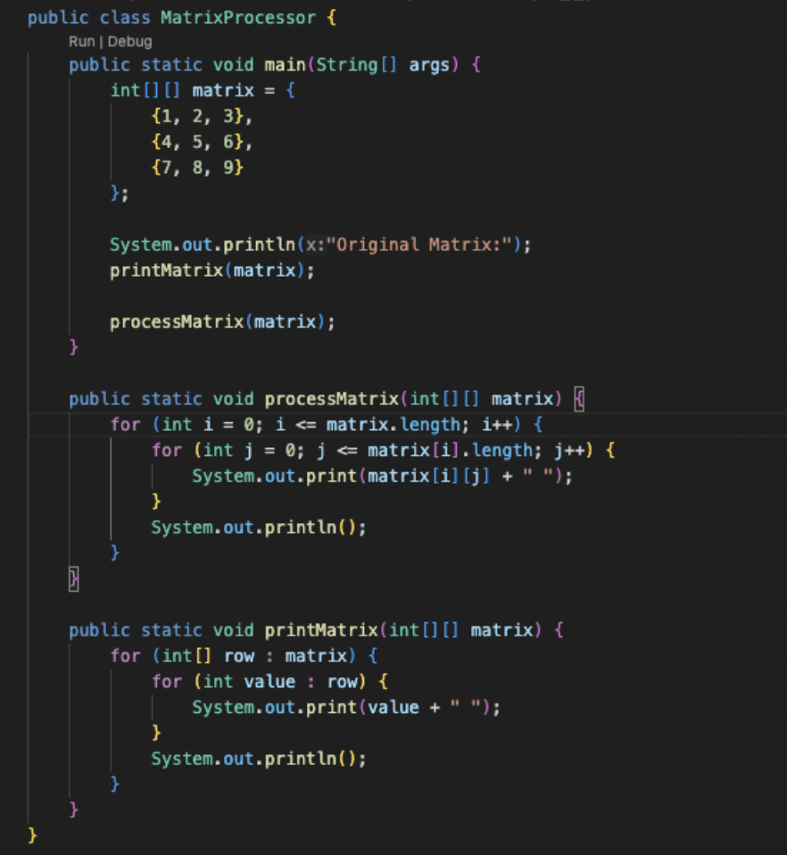
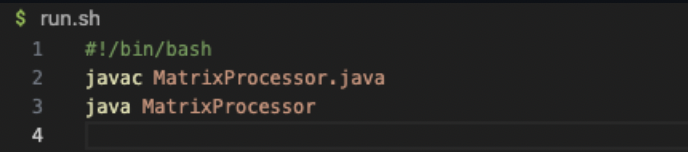
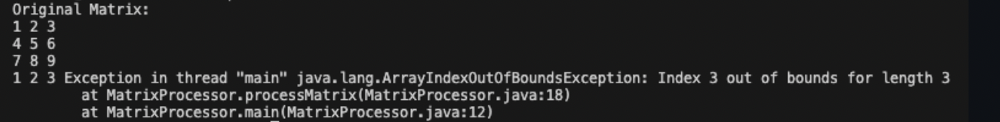
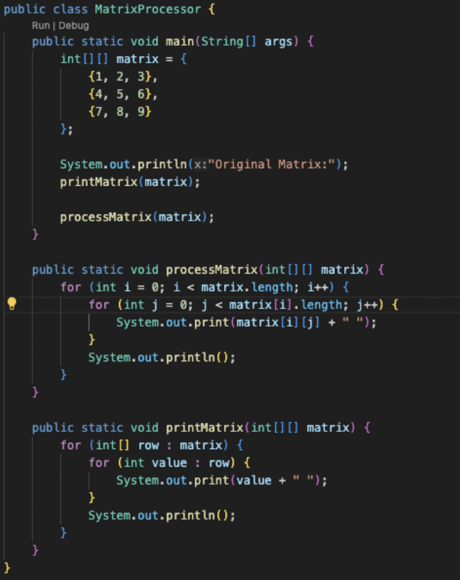

# Lab Report 5

## Part 1 – Debugging Scenario

**1. Student post with a screenshot showing a symptom and a description of a guess at the bug/some sense of what the failure-inducing input is**

  Hello! I am having trouble processing some of my Java code that deals w matrix processing. I have attached a screenshot of my issue below. The matrix is supposed to display the elements but I keep getting an error which I'm not sure how to proceed with. Any suggestions?
  Thank you!
  
  

**2. A response from a TA asking a leading question or suggesting a command to try**

  Hi! I believe that the error has something to do with the way the matrix is beting iterated. Can you show show me what the error message says when you run the bash script?
   
**3. Another screenshot/terminal output showing what information the student got from trying that, and a clear description of what the bug is.**

  

  Bug Description: 
  The ArrayIndexOutOfBoundsException occurs in the processMatrix method when trying to access an index beyond the bounds of the array. This issue arises from the loop conditions utilizing <= instead of <, resulting in an attempt to access a non-existent fourth row and fourth column in a 3x3 matrix.
   
**4. At the end, all the information needed about the setup including:**
**The file & directory structure needed**
  - MatrixProcessor.java (Java file)
  - run.sh (Bash script)
    
**The contents of each file before fixing the bug**
  MatrixProcessor.java

  

  run.sh

  
  
  **The full command line (or lines) you ran to trigger the bug**

  

  **A description of what to edit to fix the bug**
  In the processMatrix method of MatrixProcessor.java, you have to update the loop conditions to use < instead of <= to prevent accessing out-of-bounds indices:

  

  

  ## Part 2 - Reflection

  I think it's cool how we interact, similar to the collaborative push and pull process on GitHub. I did not know how to do that before. It seems really usefull for a lot of scenarios. I also really like bash. I though that its a lot more simple than having to constantly be writing commands into the terminal
