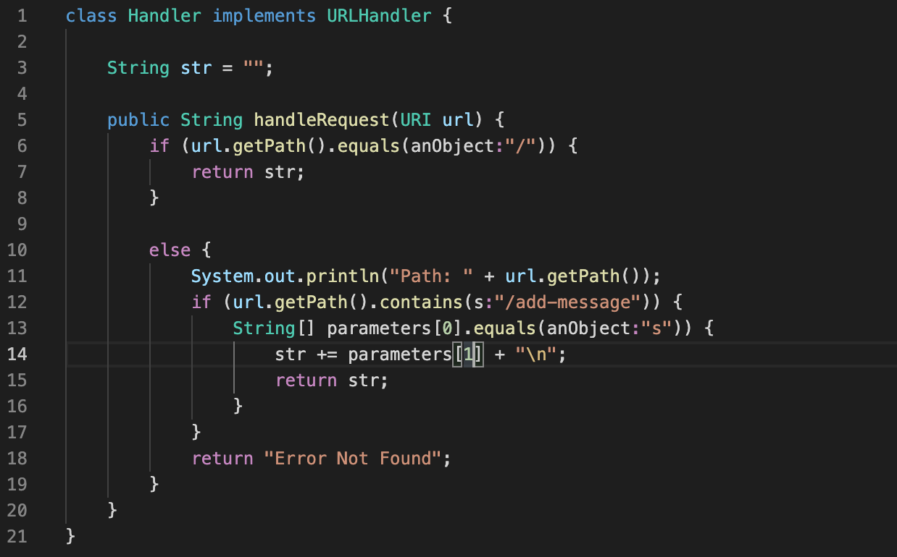

# LAB REPORT 2

## PART 1

This is the code for my StringServer below

Heres the first /addmessage screenshot

- the method used for this handler is URLHandler
- the relevant aruguments to this method is str and url. the value of str, containing the word, is meant to come after the /add-message?s=
- one of the values str was changed from "" to whatever was inputed, in this case "Hello"
  
This is the second use of the /addmessage screenshot

- the method used for this handler is URLHandler
- the relevant aruguments to this method is str and url. the value of str, containing the word, is meant to come after the /add-message?s=
- one of the values str was changed from "" to whatever was inputed, in this case "How are you". another value that changed was the URI which changed from http://localhost:4657 to http://localhost:4657/add-message?=s

# Part 2
SSH Key - Private

SSH Key - Public

Terminal Interaction

# Part 3
During week 2 and 3 I've learned about reading and writing Java code. This is my first time taking a class in Java so I'm a bit confused about some stuff but I'm getting the hang of it.
